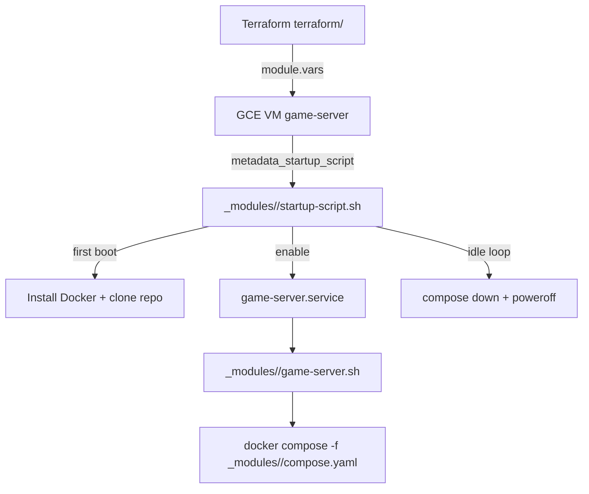

# igetit41-docker-game-server: Workload Context

Workload repo: `./GitHub/igetit41-docker-game-server`

Terraform on **Google Cloud** provisions a single **Compute Engine** VM (static IP, firewall rules, game-specific metadata). On first boot the VM installs Docker, clones this repo, and runs **Docker Compose** from `_modules/<game>/`. A **systemd** unit pulls `main` and restarts the stack. An idle-detection loop in the GCE startup script shuts the VM down when no players are connected for long enough.

This document is the cross-chat context for this workload. The main body is **game-agnostic**. Per-game details live in **appendices** at the end and should be updated as each module matures.

---

## Purpose

Run stand-alone game servers on a cost-conscious GCP VM that:

- Exposes the game on a **static external IP**
- **Auto-shuts down** when idle (save compute)
- Keeps **world/mod data** on the VM disk between restarts
- Allows **switching games** by changing which module Terraform selects (one VM, one active game today)
- Treats each game as a **self-contained module** (compose, scripts, terraform vars) so Zomboid, Minecraft, etc. can coexist in the repo without losing deploy paths

---

## Current state vs target (May 2026)

**Active effort:** Replace Zomboid as the default deployment with **Minecraft Java Edition (CurseForge modpack)**, while **preserving** the full Zomboid module for future redeploy.

| Area | Status (Phase 1) |
|------|------------------|
| Default game in `terraform/locals.tf` | `_modules/minecraft/module` (zomboid commented alternative) |
| `_modules/minecraft/` | `vars.tf`, `minecraft.env.example`, `startup-script.sh`, `game-server.sh` complete |
| `_modules/zomboid/` | Restored from git HEAD; per-module `startup-script.sh` + `game-server.sh` |
| Root `startup-script.sh` | Legacy; Valheim/7d2d module copies still use it |
| `_modules/game-server.service` | Resolves `_modules/<game>/game-server.sh` from metadata |
| `terraform/main.tf` | Embeds `_modules/<game>/startup-script.sh`; adds `SERVER_PASSWORD` metadata |

**Design decision (confirmed in chat):** Startup and game-server scripts should be **unique per game module**, not one shared script with conditionals. Each module owns ports, player-count method, config file paths, and prep steps.

**Design decision (confirmed in chat):** Do **not** delete Zomboid. Restore it as a first-class module so redeploy is a `locals.tf` source swap. Running two games **simultaneously** requires a separate Terraform instance declaration (not implemented today).

---

## Architecture



**One VM, one game:** `terraform/locals.tf` selects exactly one `module "vars"` source. That module's `game_name` output drives metadata, firewall ports, and (target) which startup script Terraform embeds.

**Module plug-in contract (target layout):**

```
_modules/<game>/
  compose.yaml           # Docker stack; container MUST be named game-server
  game-server.sh         # git pull + game-specific prep + docker compose up
  startup-script.sh      # first boot + idle shutdown + game-specific RCON/config
  module/vars.tf         # Terraform: game_name, firewall_tcp/udp, optional secrets
  *.env.example          # optional; gitignored *.env for local secrets (e.g. CF_API_KEY)
  data/                  # runtime on VM; not committed
```

Shared infra (game-agnostic):

| Path | Role |
|------|------|
| `terraform/` | GCP VM, firewall, static IP, Ops Agent, instance metadata |
| `_modules/game-server.service` | systemd unit; should resolve `_modules/$GAME_NAME/game-server.sh` from metadata |
| `README.md` | Operator-facing overview |
| `game-server_notes.txt` | Ad-hoc VM diagnostics cheat sheet (currently Minecraft-oriented) |

---

## Repository layout

```
igetit41-docker-game-server/
├── cursor-context-game-server.md   # this file
├── README.md
├── game-server_notes.txt
├── startup-script.sh               # legacy shared script (to be removed after per-module split)
├── terraform/
│   ├── locals.tf                   # game module selector + root variables
│   ├── main.tf                     # VM, firewall, metadata
│   ├── providers.tf                # local backend: ../../tfstates/game-server.tfstate
│   ├── outputs.tf                  # game_server_ip, IAP SSH command
│   ├── ops_agent.tf                # Google Ops Agent via OS Config
│   └── terraform.tfvars.example
└── _modules/
    ├── game-server.sh              # legacy shared script
    ├── game-server.service
    ├── minecraft/                  # default target module (in progress)
    ├── zomboid/                      # preserved; restore from git HEAD
    ├── valheim/                      # existing; not part of current migration
    ├── 7d2d/                         # existing; not part of current migration
    └── enshrouded/                   # compose only; no Terraform module
```

---

## Terraform and GCP (game-agnostic)

From `terraform/`:

1. Copy `terraform.tfvars.example` → `terraform.tfvars` (gitignored) or use `TF_VAR_*`
2. Set `module "vars" { source = "../_modules/<game>/module" }` in `locals.tf`
3. `terraform init` / `plan` / `apply`

**VM (`terraform/main.tf`):**

| Setting | Value |
|---------|-------|
| Name | `game-server` |
| Zone | `{REGION}-a` |
| Image | `ubuntu-os-cloud/ubuntu-2004-focal-v20250313` |
| Disk | 100 GB `pd-balanced` |
| Network | default VPC, external static IP `google_compute_address.game_server_ip` |
| Tags | `game-server` (firewall target) |
| Label | `goog-ops-agent-policy=enabled` |
| Service account | default compute SA `{PROJECT_NUM}-compute@developer.gserviceaccount.com` |

**Firewall:**

- `game-server` — ICMP + TCP/UDP ports from `module.vars.firewall_tcp` / `firewall_udp`, source `0.0.0.0/0`
- `allow-iap-ssh` — TCP 22 from `35.235.240.0/20`

**Root Terraform variables:** `PROJECT_ID`, `PROJECT_NUM`, `REGION`, `MACHINE_TYPE`, `SERVER_PASSWORD`, `RCON_PASSWORD` (sensitive).

**Ops Agent:** `terraform/ops_agent.tf` enables `osconfig.googleapis.com` and installs Ops Agent on labeled instances. Allow several minutes after apply, then use Logs Explorer (`resource.type="gce_instance"`).

**Target Terraform wiring change:**

```hcl
metadata_startup_script = file("../_modules/${module.vars.game_name}/startup-script.sh")
```

Metadata should shrink to infra-facing keys (`GAME_NAME`, optional password metadata). RCON player-check strings move into per-game startup scripts.

---

## Runtime flow (game-agnostic)

### First boot (`startup-script.sh`)

1. Read `GAME_NAME` (and secrets) from instance metadata
2. Resolve repo root (`/home/game-server/igetit41-docker-game-server` or flat clone under `/home/game-server`)
3. Create `game-server` user, install Docker, clone repo
4. Install `_modules/game-server.service`, enable and start `game-server`
5. Wait for container `game-server`, install [gorcon/rcon-cli](https://github.com/gorcon/rcon-cli) inside container when applicable
6. Apply game-specific config (password injection, sandbox edits, etc.)
7. Enter idle loop

### Steady state (`game-server.service` → `game-server.sh`)

1. `git reset --hard && git pull origin main`
2. Game-specific prep (data dirs, permissions, env file checks)
3. `docker compose --file _modules/<game>/compose.yaml up -d`

### Idle auto-shutdown

| Parameter | Default | Location |
|-----------|---------|----------|
| `CHECK_INTERVAL` | 60 seconds | startup script |
| `IDLE_COUNT` | 15 intervals (~15 min idle) | startup script |

When player count stays 0 for `IDLE_COUNT` consecutive checks: `docker compose down` then `poweroff`.

**Player detection methods by game:** RCON (Minecraft, Zomboid, 7DTD), HTTP status JSON (Valheim). See appendices.

---

## Secrets model

| Secret | Typical storage | Consumed by |
|--------|-------------------|-------------|
| `SERVER_PASSWORD`, `RCON_PASSWORD` | `terraform.tfvars` / `TF_VAR_*` | Terraform → metadata and/or startup script sed into game config |
| Game-specific API keys (e.g. CurseForge) | Gitignored `*.env` on VM | Docker Compose `env_file` |
| Hardcoded passwords in compose | **Avoid** — use placeholders + injection |

Gitignored paths (`.gitignore`): `terraform/terraform.tfvars`, `_modules/minecraft/minecraft.env`.

---

## Switching games

1. Comment/uncomment `module "vars" { source = ... }` in `terraform/locals.tf`
2. `terraform apply` (updates firewall, metadata, embedded startup script)
3. On VM: ensure game-specific secrets exist (e.g. `minecraft.env`)
4. `sudo systemctl restart game-server`

**Note:** World data lives under `_modules/<game>/data/` on the VM. Switching games does not migrate saves.

---

## Operational reference

Local operator notes: `game-server_notes.txt`

Common VM checks:

```bash
sudo systemctl status game-server --no-pager
sudo docker ps
sudo docker logs game-server --tail 80
sudo journalctl -u game-server -n 50 --no-pager
sudo grep 'startup-script' /var/log/syslog | grep -E 'player-check|PLAYERS|COUNT|shutting-down' | tail -50
```

IAP SSH command: `terraform output` from `terraform/outputs.tf`.

---

## Future development (from README)

- Dedicated **systemd unit** for idle shutdown (instead of startup-script loop)
- **Metadata-driven** idle tuning (`CHECK_INTERVAL`, `IDLE_COUNT`)
- **Per-game config files** as source of truth (example + gitignored local copy)
- **Cold-start / wake endpoint** (Cloud Run calling `instances.start` after idle `poweroff`)
- **Second VM** resource for running two games in parallel
- **Dedicated service account** with least-privilege IAM for the game VM

---

## Where to look for specific tasks

| Task | Location |
|------|----------|
| Change active game | `terraform/locals.tf` → `module "vars" { source }` |
| Change firewall ports | `_modules/<game>/module/vars.tf` |
| Change Docker image / env | `_modules/<game>/compose.yaml` |
| Change idle / RCON behavior | `_modules/<game>/startup-script.sh` (target) |
| Change pull/restart behavior | `_modules/<game>/game-server.sh` (target) |
| Change VM size / region | `terraform.tfvars` |
| VM diagnostics | `game-server_notes.txt` |

---

## References

- [itzg/docker-minecraft-server](https://github.com/itzg/docker-minecraft-server)
- [CurseForge API keys](https://console.curseforge.com/)
- [gorcon/rcon-cli](https://github.com/gorcon/rcon-cli)
- [vinanrra/Docker-7DaysToDie](https://github.com/vinanrra/Docker-7DaysToDie)

---

# Appendices

Per-game specifications. Update these as modules are implemented or changed.

---

## Appendix A: Minecraft (CurseForge) — active migration

**Status:** Phase 1 complete — `vars.tf`, `minecraft.env.example`, `startup-script.sh`, and `game-server.sh` in place. Terraform embeds `_modules/minecraft/startup-script.sh`.

**Module path:** `_modules/minecraft/`

**Image:** `itzg/minecraft-server`  
**Container name:** `game-server` (required)  
**Default modpack:** [All the Mods 9](https://www.curseforge.com/minecraft/modpacks/all-the-mods-9) via `TYPE=AUTO_CURSEFORGE` + `CF_PAGE_URL`

### Ports and firewall (planned `module/vars.tf`)

| Protocol | Ports |
|----------|-------|
| TCP | `25565` (Java client) |
| UDP | none |

RCON port `25575` is used **inside** the container for idle checks; typically **not** exposed in GCP firewall.

### Compose highlights (`compose.yaml`)

- `env_file: ./minecraft.env` — **`CF_API_KEY` required**
- `MEMORY: "12G"` — consider larger VM if modpack needs more headroom
- `ENABLE_RCON: "TRUE"`, `OVERRIDE_SERVER_PROPERTIES: "TRUE"`
- Volume: `./data:/data`

### Secrets

| File | Purpose |
|------|---------|
| `_modules/minecraft/minecraft.env.example` | Committed template (**to create**) |
| `_modules/minecraft/minecraft.env` | Gitignored; `CF_API_KEY` + optional overrides |

Before first deploy: copy example → `minecraft.env`, set API key from CurseForge console.

### Config files (in container `/data`)

| File | Notes |
|------|-------|
| `server.properties` | Join password, RCON password, game rules |

Planned injection via startup script `sed` (from Terraform `SERVER_PASSWORD` / `RCON_PASSWORD`):

- `server-password=...`
- `rcon.password=...`

### Idle detection (planned per-module startup script)

| Setting | Value |
|---------|-------|
| RCON port | `25575` |
| RCON command | `list` |
| Player count grep | Parse `There are N of a max of M` — avoid matching max-players |
| Live test | `list` (prefer over `help` on modded servers) |
| Container ready check | `pwd` == `/data` |

Uses gorcon `rcon-0.10.3-amd64_linux` installed inside container (same pattern as legacy shared script).

### `game-server.sh` prep (planned)

- Require `minecraft.env` exists or exit with clear error
- `mkdir -p data`
- `chown -R 1000:1000 data` via ephemeral `alpine:3.19` container

### First boot timing

CurseForge modpack download/install often takes **10–20+ minutes**. Watch: `sudo docker logs game-server -f`

### RCON smoke test (from `game-server_notes.txt`)

```bash
sudo docker exec -i game-server ./rcon-0.10.3-amd64_linux/rcon \
  -a 127.0.0.1:25575 -p 'YOUR_RCON_PASSWORD' "list"
```

### Historical note

Git HEAD had an older Minecraft compose: local Forge zip (`GENERIC_PACK`), 48G RAM, container name `minecraftserver-atm9`, no RCON/idle integration. Superseded by CurseForge approach in working tree.

---

## Appendix B: Project Zomboid — preserve and restore

**Status:** Restored from git HEAD. Per-module `startup-script.sh` and `game-server.sh` contain all Zomboid-specific RCON, sandbox sed, and data-dir logic.

**Module path:** `_modules/zomboid/`

**Image:** `danixu86/project-zomboid-dedicated-server:latest`  
**Container name:** `game-server`  
**Network:** `network_mode: "host"`

### Ports and firewall (`module/vars.tf` in git HEAD)

| Protocol | Ports |
|----------|-------|
| TCP | `16262-16272`, `27015` |
| UDP | `8766-8767`, `16261-16272`, `27015` |

Game port: `16261` (UDP). RCON: `27015`.

### Compose highlights (git HEAD)

- Server name: `channel27`
- `STEAMAPPBRANCH=unstable`, `MEMORY=8096m`
- Long `WORKSHOP_IDS` list (~40 workshop mods)
- Volumes:
  - `./data:/home/steam/Zomboid` — saves/config
  - `pz-dedicated:/home/steam/pz-dedicated` — named volume (Steam app)
  - `./workshop-mods:/home/steam/pz-dedicated/steamapps/workshop`

### Config files (in container)

| File | Path (relative to container workdir) |
|------|----------------------------------------|
| RCON / server ini | `./Zomboid/Server/channel27.ini` |
| Sandbox vars | `./Zomboid/Server/channel27_SandboxVars.lua` |

### Idle detection (from git HEAD `vars.tf` — move into zomboid startup script)

| Setting | Value |
|---------|-------|
| RCON port | `27015` |
| RCON command | `players` |
| Player count grep | `grep -Eo '[0-9]+'` (must be single pipeline command; no `\| head -1` in metadata grep) |
| Live test | `help` → grep `createhorde` |
| Server restart count before idle loop | `3` (docker restart to pick up config) |

### Post-start config (`exec_commands` in git HEAD — move into zomboid startup script)

Semicolon-separated `sed` commands applied after server is up:

- Sandbox: `CharacterFreePoints`, `StarterKit`, `XpMultiplier`, `MinutesPerPage`, utilities timers, `Transmission`
- Ini: `SleepAllowed=true`

### RCON commands (first run)

- `setaccesslevel D3F1L3 admin`
- Reload: `reloadlua channel27_SandboxVars.lua`

### `game-server.sh` prep (from legacy shared script — to restore in zomboid module)

- `mkdir -p data workshop-mods`
- `chown -R 1000:1000` on both dirs via alpine container

### Redeploy

1. Restore zomboid files from git HEAD (or from this appendix)
2. Set `source = "../_modules/zomboid/module"` in `terraform/locals.tf`
3. `terraform apply`
4. `systemctl restart game-server`

---

## Appendix C: Valheim — stub

**Module path:** `_modules/valheim/`  
**Terraform module:** yes (`module/vars.tf` exists)  
**Status:** Not part of current migration. Uses legacy shared startup script + metadata pattern.

**To document in a future chat:** compose image/ports, `valheim.env`, HTTP `status.json` idle detection (`rcon_compatible=false`), firewall UDP `2456-2458`.

---

## Appendix D: 7 Days to Die — stub

**Module path:** `_modules/7d2d/`  
**Terraform module:** yes (`module/vars.tf` exists)  
**Status:** Not part of current migration. Uses legacy shared startup script + metadata pattern.

**To document in a future chat:** `vinanrra/7dtd-server` image, telnet/RCON on port `8081`, `sdtdserver.xml` config, firewall TCP/UDP `26900-26902`.

---

## Appendix E: Enshrouded — stub

**Module path:** `_modules/enshrouded/`  
**Terraform module:** **no** (compose only)  
**Status:** Not wired to Terraform metadata or idle shutdown.

**To document in a future chat:** compose image, host networking, ports, env vars.

---

## Appendix changelog

| Date | Change |
|------|--------|
| 2026-05-29 | Phase 1: Minecraft module files + per-game scripts. Zomboid restored with per-game scripts. Terraform uses `_modules/<game>/startup-script.sh`. Valheim/7d2d retain legacy metadata-driven scripts as placeholders. |
