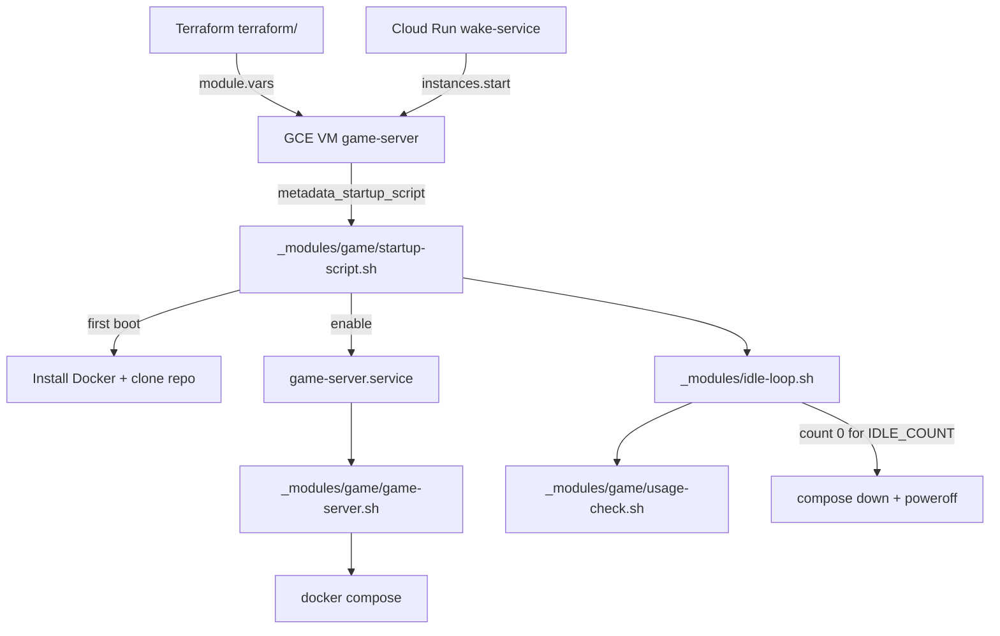

# igetit41-docker-game-server: Workload Context

Workload repo: `./GitHub/igetit41-docker-game-server`

Terraform on **Google Cloud** provisions a single **Compute Engine** VM (static IP, firewall rules, game-specific metadata). On first boot the VM installs Docker, clones this repo, and runs **Docker Compose** from `_modules/<game>/`. A **systemd** unit pulls `main` and restarts the stack. Idle detection uses a **shared idle loop** plus a **per-game `usage-check.sh`** that prints an online-player count; when that stays `0` long enough the VM `poweroff`s.

A **Cloud Run wake** service (`terraform/wake.tf`, `wake-service/`) presents a public form; submitting the wake string calls `instances.start` on the game VM.

This document is the cross-chat context for this workload. The main body is **game-agnostic**. Per-game details live in **appendices** at the end and should be updated as each module matures.

---

## Purpose

Run stand-alone game servers on a cost-conscious GCP VM that:

- Exposes the game on a **static external IP**
- **Auto-shuts down** when idle (save compute)
- Keeps **world/mod data** on the VM disk between restarts
- Allows **switching games** by changing which module Terraform selects (one VM, one active game today)
- Treats each game as a **self-contained module** (compose, scripts, terraform vars) so Zomboid, Minecraft, etc. can coexist in the repo without losing deploy paths

---

## Current state vs target (Jul 2026)

**Active effort:** Add **Smalland** module and switch the default Terraform game from Minecraft to Smalland (destroy/recreate VM). **Preserve** Minecraft and Zomboid modules.

| Area | Status |
|------|--------|
| Default game in `terraform/locals.tf` | Still `_modules/minecraft/module` until Phase 4 switch |
| `_modules/smalland/` | Active: SteamCMD update-on-start image, env/`start-server.sh`, log-based `usage-check.sh` |
| `_modules/idle-loop.sh` | Shared idle policy (interval / counter / poweroff) |
| `_modules/minecraft/usage-check.sh` | RCON `list` → integer count |
| Wake (Cloud Run) | `terraform/wake.tf` + `wake-service/` deployed; `WAKE_STRING` in tfvars |
| `_modules/zomboid/` | Preserved; not yet on `usage-check.sh` contract |

**Design decision (confirmed in chat):** Startup and game-server scripts should be **unique per game module**, not one shared script with conditionals. Each module owns ports, prep steps, and **`usage-check.sh`**.

**Design decision (confirmed in chat):** Idle **policy** is shared (`_modules/idle-loop.sh`); **detection** is per-module (`usage-check.sh` must print a single integer). RCON stays inside RCON games (Minecraft/Zomboid), not in Smalland or root Terraform switches.

**Design decision (confirmed in chat):** Do **not** delete Minecraft or Zomboid when switching games. Redeploy is a `locals.tf` source swap + VM replace. Running two games **simultaneously** is not implemented.

---

## Architecture


```mermaid
flowchart TD
  TF[Terraform terraform/] -->|module.vars| VM[GCE VM game-server]
  Wake[Cloud Run wake-service] -->|instances.start| VM
  VM -->|metadata_startup_script| SS["_modules/game/startup-script.sh"]
  SS -->|first boot| Docker[Install Docker + clone repo]
  SS -->|enable| SystemD[game-server.service]
  SystemD --> GS["_modules/game/game-server.sh"]
  GS --> DC["docker compose"]
  SS --> Idle["_modules/idle-loop.sh"]
  Idle --> UC["_modules/game/usage-check.sh"]
  Idle -->|count 0 for IDLE_COUNT| Shutdown[compose down + poweroff]
```

**One VM, one game:** `terraform/locals.tf` selects exactly one `module "vars"` source. That module's `game_name` output drives metadata, firewall ports, and which startup script Terraform embeds.

**Module plug-in contract:**

```
_modules/<game>/
  compose.yaml           # Docker stack; container MUST be named game-server
  game-server.sh         # git pull + game-specific prep + docker compose up
  startup-script.sh      # first boot + wait-until-ready + source idle-loop.sh
  usage-check.sh         # MUST print a single integer: online players (0+)
  module/vars.tf         # Terraform: game_name, firewall_tcp/udp, optional secrets
  *.env.example          # optional; gitignored *.env for local secrets
  data/                  # runtime on VM; not committed
```

**Shared (game-agnostic):**

| Path | Role |
|------|------|
| `terraform/` | GCP VM, firewall, static IP, Ops Agent, wake Cloud Run, metadata |
| `_modules/idle-loop.sh` | Idle policy only: call `USAGE_CHECK`, counter, compose down + poweroff |
| `_modules/game-server.service` | systemd; resolves `_modules/$GAME_NAME/game-server.sh` from metadata |
| `wake-service/` | Flask wake form + `instances.start` |
| `README.md` / `game-server_notes.txt` | Operator notes |

---

## Repository layout

```
igetit41-docker-game-server/
├── cursor-context-game-server.md
├── README.md
├── game-server_notes.txt
├── startup-script.sh               # legacy shared script
├── wake-service/                   # Cloud Run wake app
├── terraform/
│   ├── locals.tf                   # game module selector + root variables
│   ├── main.tf                     # VM, firewall, metadata (incl. SERVER_PASSWORD)
│   ├── wake.tf                     # Cloud Run wake + SA + secret
│   ├── providers.tf
│   ├── outputs.tf                  # game_server_ip, wake_url, IAP SSH
│   ├── ops_agent.tf
│   └── terraform.tfvars.example
└── _modules/
    ├── idle-loop.sh                # shared idle policy
    ├── game-server.service
    ├── smalland/                   # active default (SteamCMD update-on-start)
    ├── minecraft/                  # preserved; usage-check via RCON
    ├── zomboid/
    ├── valheim/
    ├── 7d2d/
    └── enshrouded/
```

---

## Terraform and GCP (game-agnostic)

From `terraform/`:

1. Copy `terraform.tfvars.example` → `terraform.tfvars` (gitignored) or use `TF_VAR_*`
2. Set `module "vars" { source = "../_modules/<game>/module" }` in `locals.tf`
3. `terraform init` / `plan` / `apply`

**VM (`terraform/main.tf`):**

| Setting | Value |
|---------|-------|
| Name | `game-server` |
| Zone | `{REGION}-a` |
| Image | `ubuntu-os-cloud/ubuntu-2004-focal-v20250313` |
| Disk | 100 GB `pd-balanced` |
| Network | default VPC, external static IP `google_compute_address.game_server_ip` |
| Tags | `game-server` (firewall target) |
| Label | `goog-ops-agent-policy=enabled` |
| Service account | default compute SA `{PROJECT_NUM}-compute@developer.gserviceaccount.com` |

**Firewall:**

- `game-server` — ICMP + TCP/UDP ports from `module.vars.firewall_tcp` / `firewall_udp`, source `0.0.0.0/0`
- `allow-iap-ssh` — TCP 22 from `35.235.240.0/20`

**Root Terraform variables:** `PROJECT_ID`, `PROJECT_NUM`, `REGION`, `MACHINE_TYPE`, `SERVER_PASSWORD`, `RCON_PASSWORD`, `WAKE_STRING` (sensitive).

**Ops Agent:** `terraform/ops_agent.tf` enables `osconfig.googleapis.com` and installs Ops Agent on labeled instances.

**Wake:** `terraform/wake.tf` builds/pushes `wake-service` via Cloud Build during apply, deploys Cloud Run `game-server-wake`, public `roles/run.invoker`. Output: `wake_url`.

```hcl
metadata_startup_script = file("../_modules/${module.vars.game_name}/startup-script.sh")
```

Instance metadata still passes RCON_* keys for modules that expose them; Smalland sets `rcon_compatible=false` and empty RCON strings. `SERVER_PASSWORD` is on metadata for games that upsert join passwords (Smalland → `PASSWORD=` in env).

---

## Runtime flow (game-agnostic)

### First boot (`startup-script.sh`)

1. Read `GAME_NAME` (and secrets) from instance metadata
2. Resolve repo root (`/home/game-server/igetit41-docker-game-server` or flat clone under `/home/game-server`)
3. Create `game-server` user, install Docker, clone repo
4. Install `_modules/game-server.service`, enable and start `game-server`
5. Wait for container `game-server` and game-specific readiness (RCON live for Minecraft; log markers for Smalland)
6. Apply game-specific config (password injection, etc.)
7. `source _modules/idle-loop.sh` with `USAGE_CHECK=_modules/<game>/usage-check.sh`

### Steady state (`game-server.service` → `game-server.sh`)

1. `git reset --hard && git pull origin main`
2. Game-specific prep (data dirs, permissions, env file checks)
3. `docker compose --file _modules/<game>/compose.yaml up -d`

### Idle auto-shutdown

| Parameter | Default | Location |
|-----------|---------|----------|
| `CHECK_INTERVAL` | 60 seconds | per-game startup script |
| `IDLE_COUNT` | 15 intervals (~15 min idle) | per-game startup script |
| Policy | shared | `_modules/idle-loop.sh` |
| Detection | per game | `_modules/<game>/usage-check.sh` → integer |

When player count stays 0 for `IDLE_COUNT` consecutive checks: `docker compose down` then `poweroff`.

**Detection by game:** RCON `list` (Minecraft), RCON `players` (Zomboid — not yet on usage-check contract), UE log RemoteAddr join/leave (Smalland). See appendices.

---

## Secrets model

| Secret | Typical storage | Consumed by |
|--------|-------------------|-------------|
| `SERVER_PASSWORD`, `RCON_PASSWORD`, `WAKE_STRING` | `terraform.tfvars` / `TF_VAR_*` | Terraform → metadata / Secret Manager / module |
| Game-specific env (CF key, Smalland settings) | Gitignored `*.env` | Compose `env_file` via `GAME_ENV_B64` |

Gitignored: `terraform/terraform.tfvars`, `_modules/minecraft/minecraft.env`, `_modules/smalland/smalland.env`.

---

## Switching games

1. Comment/uncomment `module "vars" { source = ... }` in `terraform/locals.tf`
2. `terraform apply` (updates firewall, metadata, embedded startup script)
3. On VM: ensure game-specific secrets exist (e.g. `minecraft.env`)
4. `sudo systemctl restart game-server`

**Note:** World data lives under `_modules/<game>/data/` on the VM. Switching games does not migrate saves.

---

## Operational reference

Local operator notes: `game-server_notes.txt`

Common VM checks:

```bash
sudo systemctl status game-server --no-pager
sudo docker ps
sudo docker logs game-server --tail 80
sudo journalctl -u game-server -n 50 --no-pager
sudo grep 'startup-script' /var/log/syslog | grep -E 'player-check|PLAYERS|COUNT|shutting-down' | tail -50
```

IAP SSH command: `terraform output` from `terraform/outputs.tf`.

---

## Future development (from README)

- Dedicated **systemd unit** for idle shutdown (instead of startup-script loop)
- **Metadata-driven** idle tuning (`CHECK_INTERVAL`, `IDLE_COUNT`)
- **Per-game config files** as source of truth (example + gitignored local copy)
- **Cold-start / wake endpoint** (Cloud Run calling `instances.start` after idle `poweroff`)
- **Second VM** resource for running two games in parallel
- **Dedicated service account** with least-privilege IAM for the game VM

---

## Where to look for specific tasks

| Task | Location |
|------|----------|
| Change active game | `terraform/locals.tf` → `module "vars" { source }` |
| Change firewall ports | `_modules/<game>/module/vars.tf` |
| Change Docker image / env | `_modules/<game>/compose.yaml` |
| Change idle / RCON behavior | `_modules/<game>/startup-script.sh` (target) |
| Change pull/restart behavior | `_modules/<game>/game-server.sh` (target) |
| Change VM size / region | `terraform.tfvars` |
| VM diagnostics | `game-server_notes.txt` |

---

## References

- [itzg/docker-minecraft-server](https://github.com/itzg/docker-minecraft-server)
- [CurseForge API keys](https://console.curseforge.com/)
- [gorcon/rcon-cli](https://github.com/gorcon/rcon-cli)
- [vinanrra/Docker-7DaysToDie](https://github.com/vinanrra/Docker-7DaysToDie)

---

# Appendices

Per-game specifications. Update these as modules are implemented or changed.

---

## Appendix A: Minecraft (CurseForge) — active migration

**Status:** Phase 1 complete — `vars.tf`, `minecraft.env.example`, `startup-script.sh`, and `game-server.sh` in place. Terraform embeds `_modules/minecraft/startup-script.sh`.

**Module path:** `_modules/minecraft/`

**Image:** `itzg/minecraft-server`  
**Container name:** `game-server` (required)  
**Default modpack:** [All the Mods 9](https://www.curseforge.com/minecraft/modpacks/all-the-mods-9) via `TYPE=AUTO_CURSEFORGE` + `CF_PAGE_URL`

### Ports and firewall (planned `module/vars.tf`)

| Protocol | Ports |
|----------|-------|
| TCP | `25565` (Java client) |
| UDP | none |

RCON port `25575` is used **inside** the container for idle checks; typically **not** exposed in GCP firewall.

### Compose highlights (`compose.yaml`)

- `env_file: ./minecraft.env` — **`CF_API_KEY` required**
- `MEMORY: "12G"` — consider larger VM if modpack needs more headroom
- `ENABLE_RCON: "TRUE"`, `OVERRIDE_SERVER_PROPERTIES: "TRUE"`
- Volume: `./data:/data`

### Secrets

| File | Purpose |
|------|---------|
| `_modules/minecraft/minecraft.env.example` | Committed template (**to create**) |
| `_modules/minecraft/minecraft.env` | Gitignored; `CF_API_KEY` + optional overrides |

Before first deploy: copy example → `minecraft.env`, set API key from CurseForge console.

### Config files (in container `/data`)

| File | Notes |
|------|-------|
| `server.properties` | Join password, RCON password, game rules |

Planned injection via startup script `sed` (from Terraform `SERVER_PASSWORD` / `RCON_PASSWORD`):

- `server-password=...`
- `rcon.password=...`

### Idle detection

| Setting | Value |
|---------|-------|
| Script | `_modules/minecraft/usage-check.sh` |
| RCON port | `25575` |
| RCON command | `list` |
| Player count | Parse `There are N` |
| Live test (startup wait) | `list` before entering idle-loop |
| Container ready check | `pwd` == `/data` |

Installs gorcon `rcon-0.10.3-amd64_linux` inside container from `usage-check.sh` when missing. Idle policy: `_modules/idle-loop.sh`.

### `game-server.sh` prep

- Require `minecraft.env` via `GAME_ENV_B64`
- `mkdir -p data`
- `chown -R 1000:1000 data` via ephemeral `alpine:3.19` container

### First boot timing

CurseForge modpack download/install often takes **10–20+ minutes**. Watch: `sudo docker logs game-server -f`

### RCON smoke test (from `game-server_notes.txt`)

```bash
sudo docker exec -i game-server ./rcon-0.10.3-amd64_linux/rcon \
  -a 127.0.0.1:25575 -p 'YOUR_RCON_PASSWORD' "list"
```

### Historical note

Git HEAD had an older Minecraft compose: local Forge zip (`GENERIC_PACK`), 48G RAM, container name `minecraftserver-atm9`, no RCON/idle integration. Superseded by CurseForge approach.

---

## Appendix B: Project Zomboid — preserve and restore

**Status:** Restored from git HEAD. Per-module `startup-script.sh` and `game-server.sh` contain all Zomboid-specific RCON, sandbox sed, and data-dir logic.

**Module path:** `_modules/zomboid/`

**Image:** `danixu86/project-zomboid-dedicated-server:latest`  
**Container name:** `game-server`  
**Network:** `network_mode: "host"`

### Ports and firewall (`module/vars.tf` in git HEAD)

| Protocol | Ports |
|----------|-------|
| TCP | `16262-16272`, `27015` |
| UDP | `8766-8767`, `16261-16272`, `27015` |

Game port: `16261` (UDP). RCON: `27015`.

### Compose highlights (git HEAD)

- Server name: `channel27`
- `STEAMAPPBRANCH=unstable`, `MEMORY=8096m`
- Long `WORKSHOP_IDS` list (~40 workshop mods)
- Volumes:
  - `./data:/home/steam/Zomboid` — saves/config
  - `pz-dedicated:/home/steam/pz-dedicated` — named volume (Steam app)
  - `./workshop-mods:/home/steam/pz-dedicated/steamapps/workshop`

### Config files (in container)

| File | Path (relative to container workdir) |
|------|----------------------------------------|
| RCON / server ini | `./Zomboid/Server/channel27.ini` |
| Sandbox vars | `./Zomboid/Server/channel27_SandboxVars.lua` |

### Idle detection (from git HEAD `vars.tf` — move into zomboid startup script)

| Setting | Value |
|---------|-------|
| RCON port | `27015` |
| RCON command | `players` |
| Player count grep | `grep -Eo '[0-9]+'` (must be single pipeline command; no `\| head -1` in metadata grep) |
| Live test | `help` → grep `createhorde` |
| Server restart count before idle loop | `3` (docker restart to pick up config) |

### Post-start config (`exec_commands` in git HEAD — move into zomboid startup script)

Semicolon-separated `sed` commands applied after server is up:

- Sandbox: `CharacterFreePoints`, `StarterKit`, `XpMultiplier`, `MinutesPerPage`, utilities timers, `Transmission`
- Ini: `SleepAllowed=true`

### RCON commands (first run)

- `setaccesslevel D3F1L3 admin`
- Reload: `reloadlua channel27_SandboxVars.lua`

### `game-server.sh` prep (from legacy shared script — to restore in zomboid module)

- `mkdir -p data workshop-mods`
- `chown -R 1000:1000` on both dirs via alpine container

### Redeploy

1. Restore zomboid files from git HEAD (or from this appendix)
2. Set `source = "../_modules/zomboid/module"` in `terraform/locals.tf`
3. `terraform apply`
4. `systemctl restart game-server`

---

## Appendix C: Valheim — stub

**Module path:** `_modules/valheim/`  
**Terraform module:** yes (`module/vars.tf` exists)  
**Status:** Not part of current migration. Uses legacy shared startup script + metadata pattern.

**To document in a future chat:** compose image/ports, `valheim.env`, HTTP `status.json` idle detection (`rcon_compatible=false`), firewall UDP `2456-2458`.

---

## Appendix D: 7 Days to Die — stub

**Module path:** `_modules/7d2d/`  
**Terraform module:** yes (`module/vars.tf` exists)  
**Status:** Not part of current migration. Uses legacy shared startup script + metadata pattern.

**To document in a future chat:** `vinanrra/7dtd-server` image, telnet/RCON on port `8081`, `sdtdserver.xml` config, firewall TCP/UDP `26900-26902`.

---

## Appendix E: Enshrouded — stub

**Module path:** `_modules/enshrouded/`  
**Terraform module:** **no** (compose only)  
**Status:** Not wired to Terraform metadata or idle shutdown.

**To document in a future chat:** compose image, host networking, ports, env vars.

---

## Appendix F: Smalland — Survive the Wilds

**Status:** Active Terraform game. Uses SteamCMD update-on-start (not the frozen Hub image).  
**Module path:** `_modules/smalland/`  
**Image:** built locally as `smalland-steamcmd:local` from `cm2network/steamcmd:root` + `_modules/smalland/Dockerfile`  
**Steam App ID:** `808040` (anonymous `app_update` on every container start; **no** `validate`)  
**Container name:** `game-server`  
**RCON:** none (game has no RCON/admin console)

### Why not Hub

`lucasromanomr/smalland-steam-server:latest` was pinned at ProjectVersion `1.5.1` (compiled Nov 2024). Client builds (e.g. Steam build `22695059`) did not list it in the public browser even though `RegisterServer` succeeded. Fix: install/update DS from Steam on start so version tracks the client.

### Image / volumes

| Field | Value |
|-------|--------|
| Base | `cm2network/steamcmd:root` (steam UID/GID `1000`) |
| Entrypoint | `/entrypoint.sh` → SteamCMD `app_update 808040` → `/start-server.sh` |
| Game + saves volume | `./server-files` → `/home/steam/smalland-server` (persisted; gitignored). Saves live under `.../SMALLAND/Saved` inside this tree |
| Start script | `./start-server.sh` → `/start-server.sh:ro` (env-driven params) |
| Ports | `7777`/`7778` TCP+UDP |

**Do not** bind-mount a separate host dir onto `.../SMALLAND/Saved`. That nest created `SMALLAND/` as `root:root` before SteamCMD commit, which failed with `Missing file permissions` on `SMALLAND/Binaries` (state `0x602`).

### Compose / env

- `env_file`: `smalland.env` (from `smalland.env.example`; gitignored)
- `game-server.sh` chowns `server-files/` to `1000:1000`, `docker compose build`, then `up -d`
- First boot (empty `server-files`): long Steam download before listen; later wakes: short no-op `app_update` when already current
- Do not patch a live VM for this — push and `terraform apply -replace=google_compute_instance.game_server`
- `SERVER_PASSWORD` metadata upserts `PASSWORD=` in `smalland.env`
- Cross Play required for dedicated servers in the browser
- `game-server.service` exiting success/`inactive` after `compose up` is normal; container keeps running under Docker

### Idle detection

| Setting | Value |
|---------|-------|
| Script | `_modules/smalland/usage-check.sh` |
| Method | Log window join/leave → set in `/var/tmp/smalland-online-players`. Joins: any `NotifyAcceptingConnection` line’s `IP:port`, plus `Join succeeded: Name`. Leaves: Close/Closing/Cleaned-up lines’ `IP:port`. Do not require exact `accepted from ` wording (Shipping uses `from:`). |
| Ready wait | Full `docker logs` for `IpNetDriver listening on port` (observed on live boot). Never `--tail N` — streaming buries early markers. Each loop logs container status + matched line. |
| Policy | `_modules/idle-loop.sh` |

**Calibrate after first live join/leave** — adjust greps if Smalland’s log lines differ from stock UE patterns.

### Redeploy (Phase 4 done; locals point at Smalland)

1. Ensure `smalland.env` exists locally (gitignored); push module files to `main`
2. Align `terraform.tfvars` `SERVER_PASSWORD` with `smalland.env` `PASSWORD` (VM upserts `PASSWORD=` from metadata and overwrites the env line)
3. Replace instance only — keep static IP + wake: `terraform apply -replace=google_compute_instance.game_server` (do not destroy wake resources / wake secret if players already have `wake_url` + `WAKE_STRING`)
4. Join with Cross Play enabled. If `PRIVATE=1`, the server is hidden from the public browser — use direct connect / favorites
5. Calibrate idle greps from one join/leave: `docker logs game-server | grep -E 'NotifyAcceptingConnection|Join succeeded|UNetConnection::Close'`

### Local smoke test (optional, before GCP)

From `_modules/smalland/` with Docker installed:

```bash
docker compose build
docker compose up -d
docker logs game-server -f
docker compose down
```

First `up` downloads app `808040` into `./server-files` (long). Later ups should be mostly a quick `app_update`. Does not replace GCP first-boot / wake / metadata testing.

---

## Appendix changelog

| Date | Change |
|------|--------|
| 2026-07-25 | Smalland: drop nested `./data` Saved mount (SteamCMD `0x602` / root-owned `SMALLAND/`). |
| 2026-07-25 | Smalland: replace Hub image with SteamCMD update-on-start (`Dockerfile`/`entrypoint.sh`, persist `server-files/`). |
| 2026-07-25 | Usage-check contract + `idle-loop.sh`. Minecraft RCON moved to `usage-check.sh`. Smalland module Phases 1–3 + Appendix F. Wake Cloud Run documented. |
| 2026-05-29 | Phase 1: Minecraft module files + per-game scripts. Zomboid restored with per-game scripts. Terraform uses `_modules/<game>/startup-script.sh`. Valheim/7d2d retain legacy metadata-driven scripts as placeholders. |
